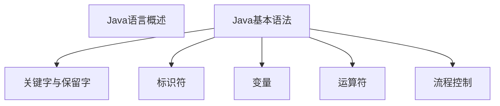

# Java语言概述

+ 软件是什么？有哪几种区分？
+ 人机交互方式有哪几种？
+ 计算机语言有哪几代语言？
+ Java语言的历史和里程碑事件是什么？
+ 什么是Java SE？什么是Java EE？什么是Java ME？什么是Java Card？
+ Java的应用领域有哪些？
+ Java有什么特点？详细说明一下。
+ Java的两种核心机制是什么？
+ 什么是JDK,JRE与JVM，他们的区别是什么？
+ java文件编译运行的过程 描述一下
+ Java规范的三种注释方法有什么？
+ 注释的作用是什么？特点是什么？多行注释不可以做什么？
+ 什么是文档注释？

# Java基本语法|关键字与保留字

+ 什么是关键字，有什么特点？什么是保留字

# Java基本语法|标识符

+ 什么是Java标识符？
+ 它的命名规则是什么？
+ 命名规范有哪些？

# Java基本语法|变量

+ 变量的组成是什么？
+ 变量按数据类型的分类是？各种基本类型占多少字节？
+ 变量根据在类中的位置可以分为？
+ 基本数据类型自动类型提升的规则？
+ 什么是强制类型转换，如何强转，缺点是什么？
+ 计算机底层如何存储数据？
+ 原码反码补码的计算规则？

# Java基本语法|运算符

+ ++ -- 和 a = a + 1  a = a - 1 有什么区别？
+ += -= 和a = a + 1 a = a - 1 有什么区别？
+ 在逻辑运算符中 &与&&   |与||有什么区别？逻辑运算符大概有哪几种？
+ 逻辑运算中异或用什么表示？
+ 位运算符中 >> 与 >>> 有什么区别？
+ 位运算中异或和取反用什么表示？
+ 交换两个变量的方式有哪几种？
+ 三元运算符是什么？

# Java基本语法|程序流程控制

+ 有哪三种基本流程结构？
+ 表示分支的语句有哪些？
+ 表示循环的语句有哪些？
+ switch括号中的变量可以是什么？
+ 退出循环的方式有哪些？
+ break和continue有什么相同点和不同点？